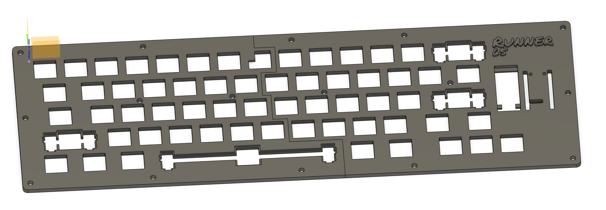
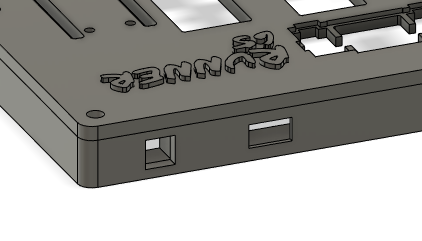
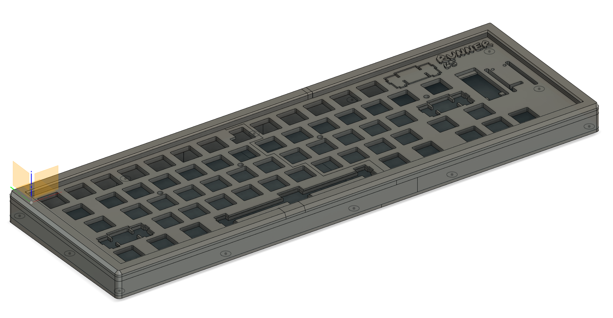
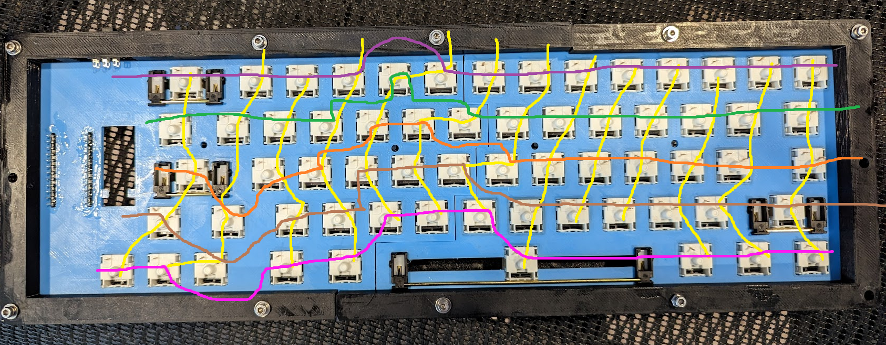
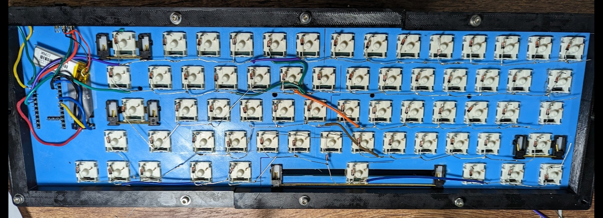
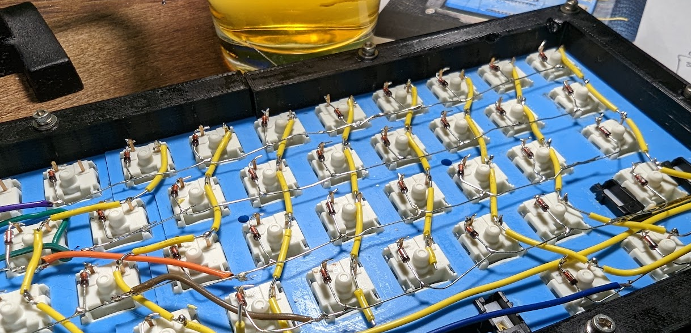
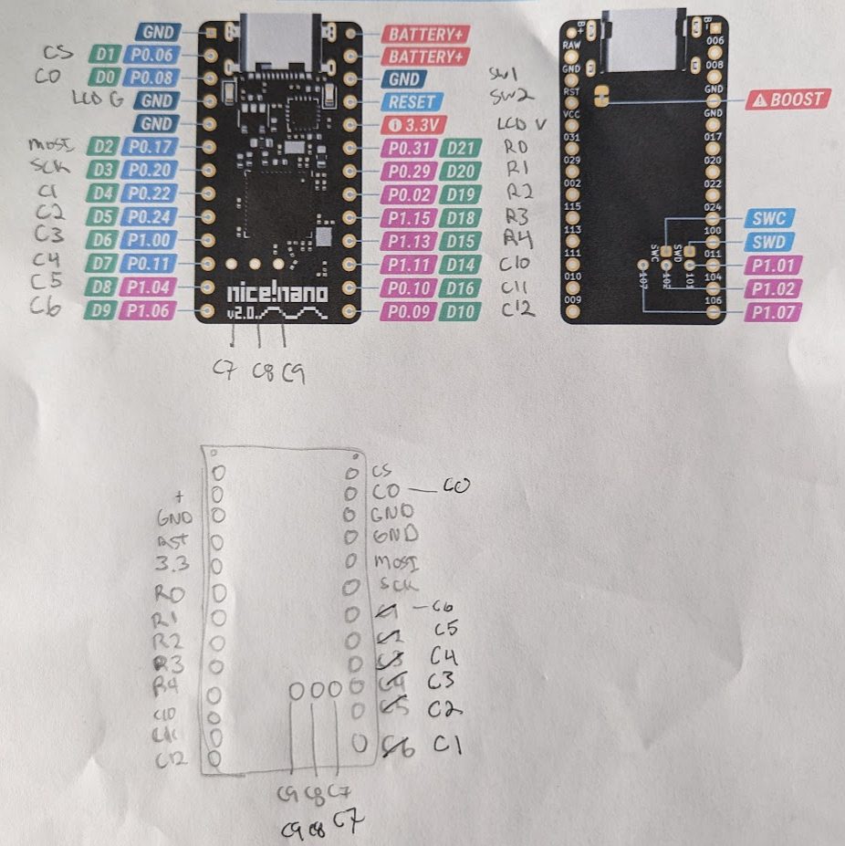
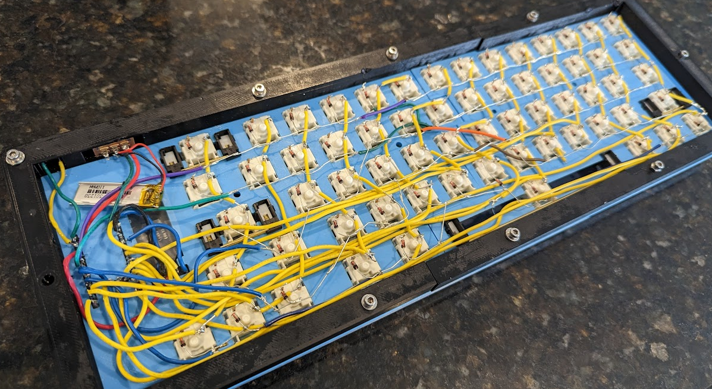
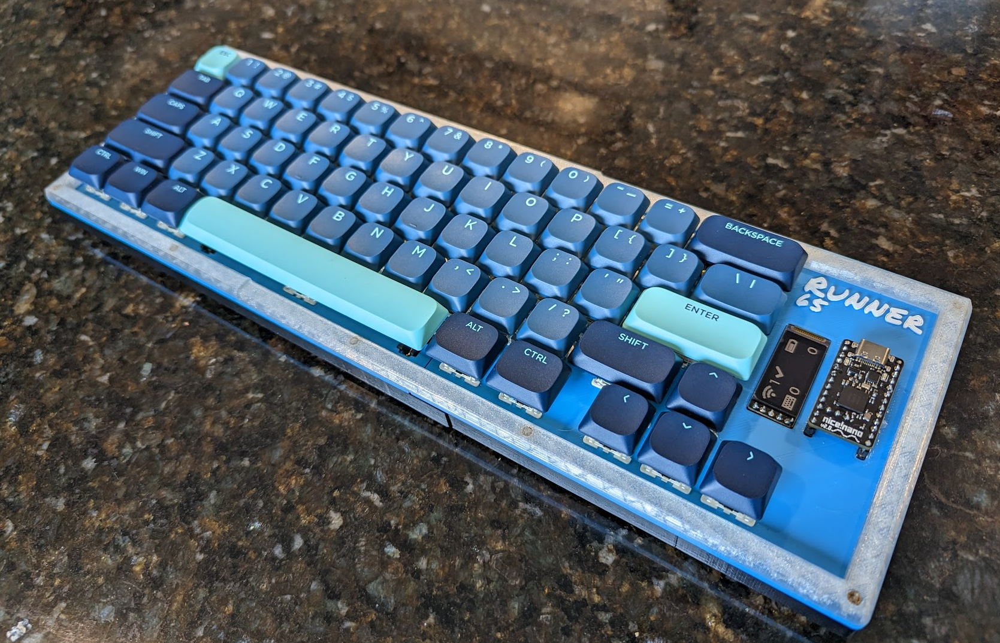

# Building a 65 (actually more like 60ish) Mechanical Keyboard

I wanted to do a small crash course in learning how to build my own mechanical keyboard with essentially no background whatsoever. With the help from co-workers, youtube, google, and discord
I was able to get a "first iteration" working. I'm excited to say that I'm actually using the keyboard that was designed to type this right now!

With that being said, I wanted to go back and add this readme to help share some of the documentation and issues I encountered to maybe help those that
want to do a similar project. I probably spent twice as much to make something half as good, but it was definitely fun!

## The Parts

Below are the parts I purchased for this project:

- $25 - [Nice!Nano](https://nicekeyboards.com/nice-nano/) micro-controller - I wanted bluetooth
- $20 - [Nice!View](https://nicekeyboards.com/nice-view) - I wanted an OLED screen to display random stuff.
- $3 - [110mA Battery](https://typeractive.xyz/products/lithium-battery-110mah) - I wanted this to be wireless (for those wondering, after about a week of use, I'm at 80%)
- $35.31 [72 pcs Yellow Switches](https://www.amazon.com/dp/B09VBKZPMW?psc=1&ref=ppx_yo2ov_dt_b_product_details) - I tested a bunch, liked these.
- $5.99 [100 pieces diodes 1N4148](https://www.amazon.com/dp/B079KJ91JZ?psc=1&ref=ppx_yo2ov_dt_b_product_details)
- $11.22 [Low Profile keycaps](https://www.aliexpress.us/item/3256804654045406.html) - I really liked the look of these.
- $7.90 [Cheap Stabilizers](https://www.amazon.com/gp/product/B09RFFBSY2)
- $10 [Pin Headers](https://www.amazon.com/gp/product/B07BS126FK)

Rough Estimate: $108

The rest of the parts I had on hand, but do have links to what they were

- $100 - $200 - Ender 3D printer
- $10-20/color - PLA/PLA+ 1.75mm 3D printing filament
- $12 - [Copper heat pass knurl nuts](https://www.amazon.com/gp/product/B07GLJ7KCJ/ref=ppx_yo_dt_b_search_asin_title?ie=UTF8&psc=1) - These were to help assemble some of the 3D printer cost
- $15 - [Assortment of hex bolts](https://www.amazon.com/gp/product/B08VHVB4H5) - Also to help assemble the printer
- $XX - Wires

## The Design

When I started this, I knew I was going to have some specific base requirements.

- I also wanted a medium size form factor (65% keyboard)
- I wanted a visible screen
- I decided everything else on the fly based on what was working.

### The Name - Runner65

Running is another hobby I have that I take relatively seriously. With that being said and that fact I wanted around a 65% layout... I called this the Runner65 and didn't look back.
(Mistake #1: only to realize completely after the project that I was really more like a 60% keyboard)

## The Modelling

I want to mention that I went through many different print test just shifting space around (that is the beauty of having a printer... its really not a big deal)! I highly recommend making smaller bodies and printing test
pieces to just make sure everything fits as expected. As ou can see in some images, my bodies are usually split. This is because my Ender 3 unfortunately wasn't big enough to print pieces full size.

### Building the key layout

I used the [keyboard-layout-generator example](http://www.keyboard-layout-editor.com/#/gists/3153b57d269235c12f4c) to start off with. I removed the button row and the PgUp, Delete, Home, and End keys
because that is where I was going to put the screen. I ended up mostly with the json below.

```
[{a:6},"Esc",{a:4},"!\n1","@\n2","#\n3","$\n4","%\n5","^\n6","&\n7","*\n8","(\n9",")\n0","_\n-","+\n=",{a:6,w:2},"Backspace"],
[{w:1.5},"Tab",{a:4},"Q","W","E","R","T","Y","U","I","O","P","{\n[","}\n]",{w:1.5},"|\n\\"],
[{a:6,w:1.25,w2:1.75,l:true},"Caps Lock",{x:0.5,a:4},"A","S","D","F","G","H","J","K","L",":\n;","\"\n'",{a:6,w:2.25},"Enter"],
[{w:2.25},"L_Shift",{a:4},"Z","X","C","V","B","N","M","<\n,",">\n.","?\n/",{a:6,w:1.75},"R_Shift",{a:4},"↑"],
[{a:6,w:1.25},"L_Ctrl",{w:1.25},"Win",{w:1.25},"L_Alt",{a:7,w:6.25},"",{a:2,w:1.25},"R_Alt\n\n\n\nFn_1",{w:1.25},"R_Ctrl\n\n\n\nFn_2",{x:0.5,a:4},"←","↓","→"]
```

The next step where to use [swillkb](http://builder.swillkb.com/) to generate the actual DXF file. I used MX \_t:1 switch types and Cherry only \_s:2 switch type. I did leverage this [youtube](https://www.youtube.com/watch?v=7azQkSu0m_U)
for a lot of great information about this process as well.

### Modelling the layout

I used Fusion360 for my modelling. Its free for hobbyist and a really powerful tool.
The first step is to import the DFX file. This will essentially add as sketch that you can model off of. From there, I added some holes for knurl nuts, the name "Runner 65", a spot for the screen,
and a place to glue in sockets.


Some notes:

- To fit my stabilizers better, I had to push down a border. My final designs were still not a perfect fit, but was good enough to just take a nice to help.

### Modelling the rest

I'm grouping the other pieces as "the rest" because most of it was just user preference.

- I highly recommend adding a switch so you can control when it powers off the battery.
- I also added a button that connected the RST and GND pins so I could put the micro-controller in bootloader mode more easily (which was really nice when I was just updating one-off keys after it was built)

  

### The final product

The rest was modelling differently layers to the heights I felt comfortable with. I wanted to make sure I had enough room to fit the wires. The base layer was also done with a 1 degree slant just to make it not completely flat.  
 I might redo this and make this a 2 degree slant because I can't honestly feel that much of a difference.



## The Building

Once pieces where 3D printed, I glued in the sockets and added the switches in place. The switch should be very snug when being pushed in and the stabilizers should be even tighter. I absolutely poked myself a couple times trying to get these in.  
(Mistake #2: My switches are actually labelled to a specific keyboard key. A subtle detail that I totally missed. Not a big deal of course but would have helped with the programming a bit.)

At this point, I wanted to go ahead and solder in the switch, reset button, and battery to get that out of the way.

### The Sockets

I went ahead and solder header pins to the nice!nano. I wanted to easily be able to pull this in and out of my breadboard and final board. You can see in the 3D print design, I made the space to glue in the header pins so I could just put in my board.
(Mistake #3: I solder wires for the battery to the nice!nano to the switch so I can't actually take out or replace the nice!nano.)

### The Matrix Wiring

The part to be careful here is really figuring out how many pins you have available on your micro-controller and how your rows+columns number is going to be less then that (i.e. 14 columns and 5 rows = 19 pins needed ).
To make sure no key is wired on a row or column value you aren't going to assign, you may have to get a bit creative. Take your time with this and draw it out BEFORE solder anything.



From there, I started with soldering the diodes to get the rows soldered. These were long and flexible so they made it easy.



The next step was doing the columns according to my matrix diagram. Using wire cutters, strip small gaps in the wires so you are exposing too much excess wire that a row might end up touching.



When I was complete and it was time to test the firmware, I definitely had "renegade" key presses going on. I found that this was because some of my diode wires were sharp enough to connect the circuit of other rows. To fix this, I just had to move some more of the wire encasing around.

### The Pin Assignment

I printed off the diagram of the Nice!Nano and then actually drew out which columns and rows I were going to put to each pin. Since you solder from the back, just be aware that you are soldering the backwards. I absolutely made a few mistakes with this the first time and had to solder some of my pins.



I felt this was the most difficult part just because wires were starting to get crammed together. This is another reason in my design (since this was my first keyboard) that I wanted a little extra space in the design.



#### Some defaults

Screen pins. I couldn't find it in the original documentation so it took some searching in discord but the default pins for the OLED are `mosi = P0.17 and sck = P0.20`.

## The Coding

Before even trying any modelling, I wanted to try loading a base firmware to the micro-controller to just get a good understanding of that. ZMK and Nice!Nano made that simple by auto triggering github actions to generate the firmware
and then the N!N (Nice!Nano) having a "drag and drop" function for loading the firmware.

Some information about the shield files...

### build.yaml

This just needed the name of the shield, `nice_view_adapter` and `nice_view` since I was using the screen. The shield name MUST be consistent across all the following files.

### Kconfig.defconfig

This needed the name of my board. This translates to the BT name that will be translated as well.

### Kconfig.shield

This needed to reference the shield name. **One item here that caused troubles was having an [extra space](https://github.com/jh442/zmk-config/commit/60402e229704a8cd708d741fd00f974ca41569ce) in the parameters!**

### runner65.conf

This has the basic config settings for the board and what widgets you want to display on the screen. To help troubleshooting BT connection issues, I did occasionally set up `CONFIG_ZMK_USB_LOGGING`.

### runner65.overlay

The important part here was to understand the pin assignment. Again, I highly recommend drawing this out and I also recommend using the GPIO pin assignment [instead of the pro_micro reference](https://github.com/jh442/zmk-config/commit/2a1e68298393d6b397e3fcfd9a384f265368d2a5). For me, it was more clear for documentation.

I matrix mapping should follow your diagram. With spacing maybe not reflecting your keys, setting the correct `RC()` values can get a bit confusion. I definitely made a couple mistakes here when testing my first iterations of the firmware.

### runner65.keymap

The keymap file is where you assign the keys from your matrix. The layout of this _should_ match that of what was in your overlay. I did notice my keyboard behavior being all over the place which was caused by me missing a keymap value, causing my row/column amounts to not match.

I first started working on getting my top layer to work as I would expect. Then I moved onto the BT, where nothing would connect. If you want BT to work, you MUST have a BT layer set up (`&mo 1` access). If anything, so you can control which BT profile you are using or if you need to clear them. I didn't quite understand this when I was first setting this all up.

If you connect your phone to keyboard, it will reserve that profile connection to your phone, so you can switch it, clear it, etc unless you have a programmatic way to do that through your keyboard (i.e. `BT_CLR`, `BT_SEL X`).

The [Keyboard Tester](keyboardtester.com/) website was a great resource for seeing if I had my keys set correctly. I had a sign of relief when I felt like I was just to the point where I was adding different key commands to be second layer for convenience instead of fixing a problem.

## The Finished Product

Does this compare to your high end keyboards...definitely not. Do my stabilizers sound different from the normal keys... yup. Will this break in about 3 weeks... that is definitely a possibility (especially since I bring it to and from work). But I do have this completely unique keyboard that I'm really happy with how it all turned out and it was a fun learning experience. I'm already tempted to make a 2nd one with all that I've learned from this run and the mechanical keyboard hobby in general.

I'm also tempted to get a larger 3D printer, just so I can make the pieces complete.

The next steps might be to learn how to design a PCB so I can save the hours of hand wiring future models!


